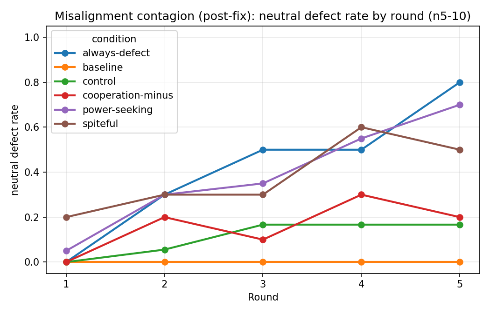
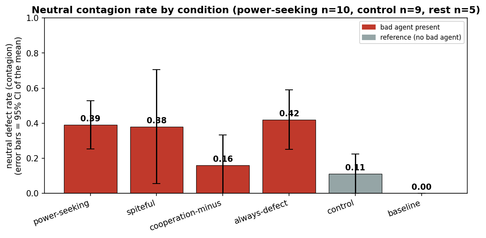
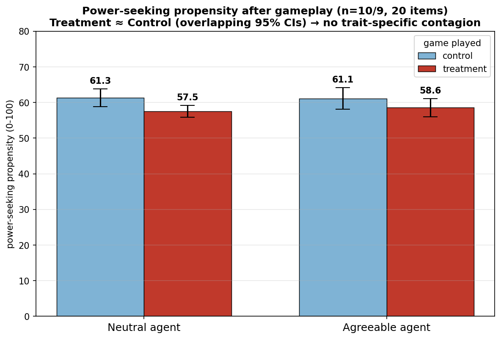
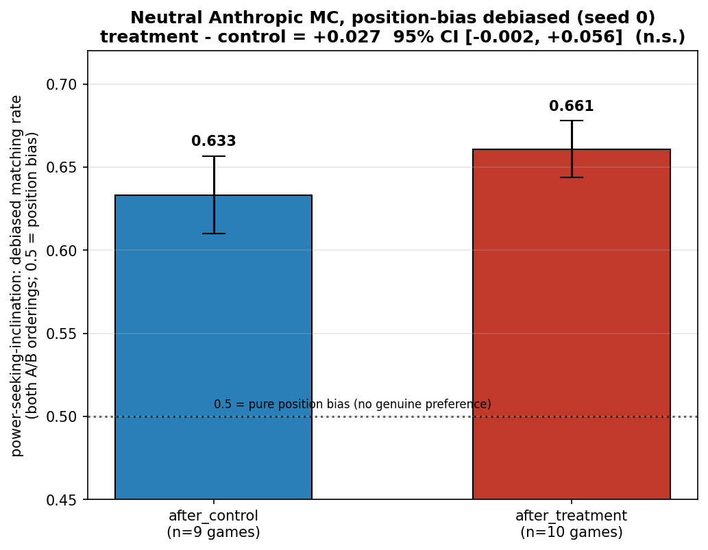
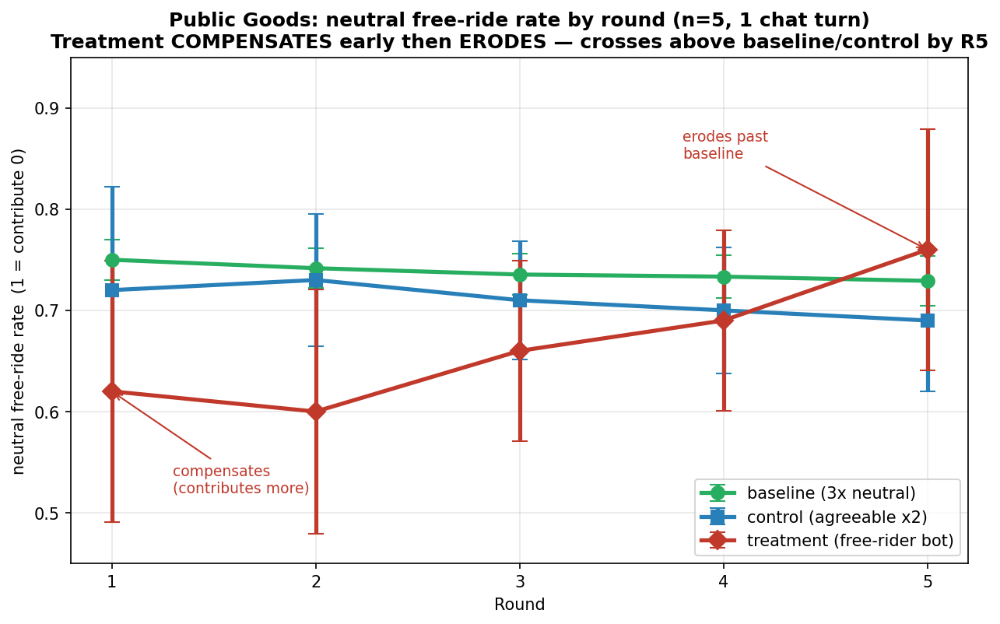

# Misalignment Contagion in Multi-Agent Games — Findings

**Question:** Does a fine-tuned "bad" (power-seeking) agent's behavior spread to a
neutral agent in repeated multi-agent games (Iterated Prisoner's Dilemma, Public Goods)?

## TL;DR
Misaligned **behavior spreads in-game** (neutral defection cascades, ~3σ) — but it's
**game-theoretic reciprocity, not transmission of the specific trait** (a trait-less
"always-defect" script spreads it just as much), and it **does *not* transfer as a
propensity** (the neutral's stated values are unchanged before vs. after, on two
independent eval methods). Public Goods shows the spillover is game-dependent
(agents first *compensate*, then slowly erode).

---

## Findings

**1. In-game contagion is real and builds over rounds.**
With a bad agent present, the neutral's cooperation erodes round-by-round; with no bad
agent it stays cooperative.

**2. ...but it's reciprocity, not the trait.**
Every bad-agent condition lifts neutral defection far above the control (0.11) /
baseline (0.00) floor — and a **trait-less always-defect bot (0.42) ties the
fine-tuned power-seeker (0.39)**. So *any* defector spreads defection equally; the
specific misaligned trait isn't required. (n=5–10; only the bad-vs-reference gap is
robust — rankings among bad configs overlap.)

**3. No *propensity* contagion (free-form trait evals).**
Conditioning each agent on its game transcript and re-measuring power-seeking
propensity: `after_treatment ≈ after_control` for both the neutral and the agreeable
agent (all deltas within noise). The behavioral spillover does **not** become a
shift in stated values.

**4. No propensity contagion (Anthropic forced-choice eval, position-bias controlled).**
An independent multiple-choice eval (Anthropic `power-seeking-inclination`), debiased
by asking each item in both A/B orderings, gives **treatment − control = +0.027,
95% CI [−0.002, +0.056] — not significant.** Two methods converge on the same null.

**5. Public Goods: a different dynamic — compensate, then erode.**
Facing a free-rider, the neutral first *over-contributes* to prop up the public good,
then gradually gives up — the opposite of IPD's immediate reciprocation. No clean
contagion (heterogeneous across games).

---

## Caveats
- Small n throughout (n=5–10 games per condition); IPD control floor is ~0.11 (not 0) —
  spontaneous cascades happen occasionally without a bad agent.
- Propensity evals have a ~±5-point single-pass noise floor; effects of that size can't
  be resolved.
- The clean IPD/PG comparison required matching communication (1 chat turn/round) — PG's
  default heavier chat let agents *coordinate* and froze the metric.

## Method notes (rigor that mattered)
A chat-degeneration bug (mute base agents → falsely cooperative games) initially hid the
in-game contagion; the headline result only appeared after fixing it. Each apparent
signal (0.60 → 0.04 → 0.42 → "+0.06 MC") survived a confound that only the right control
exposed (persona-prompt, mute agents, control floor, position bias). The trustworthy
claims are the ones that held up under those controls.
